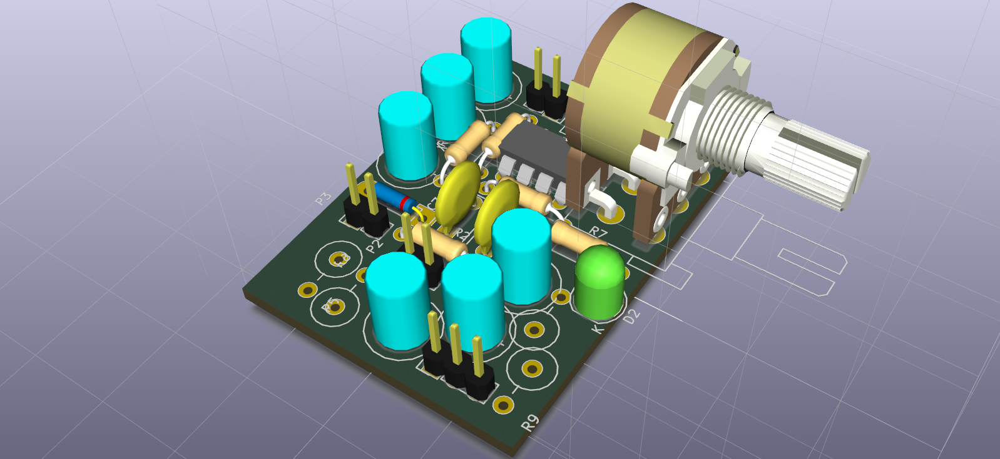
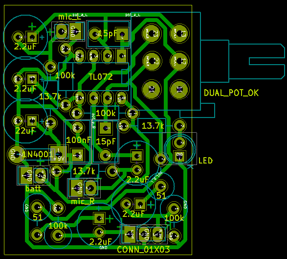
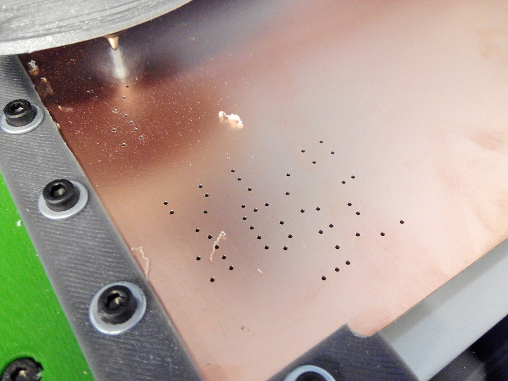
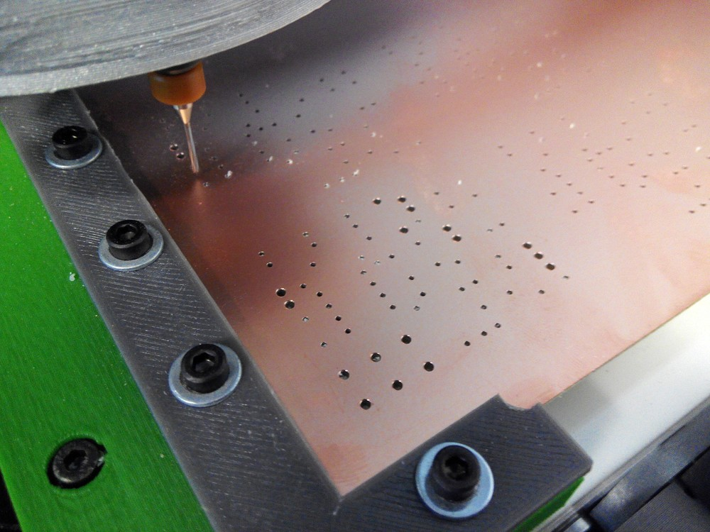
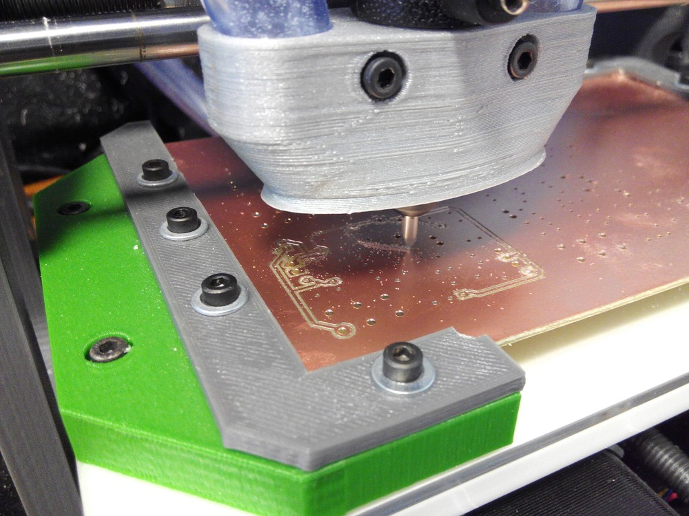
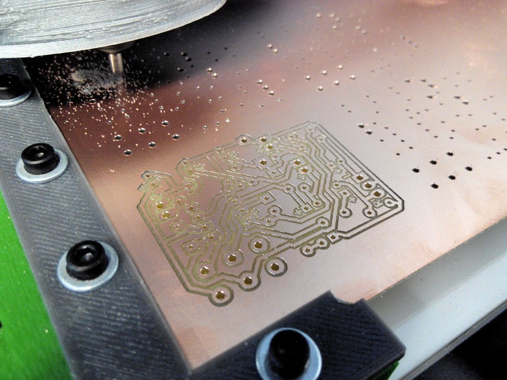
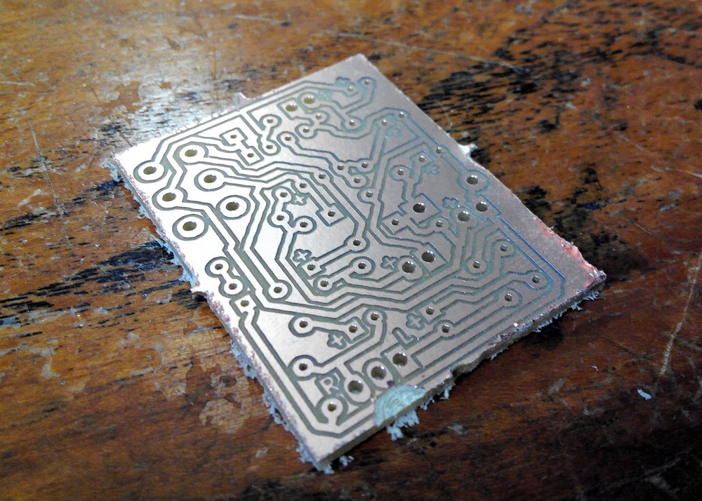
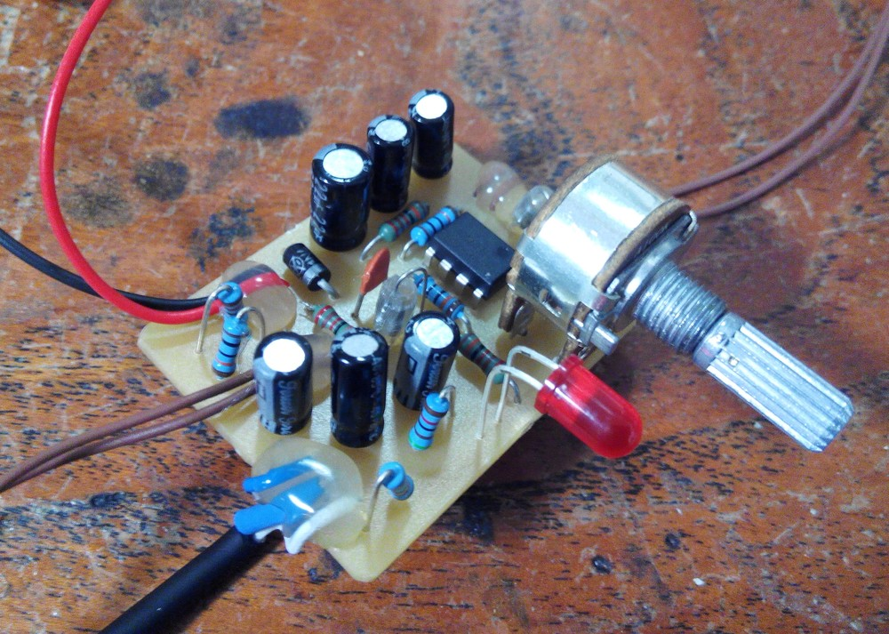
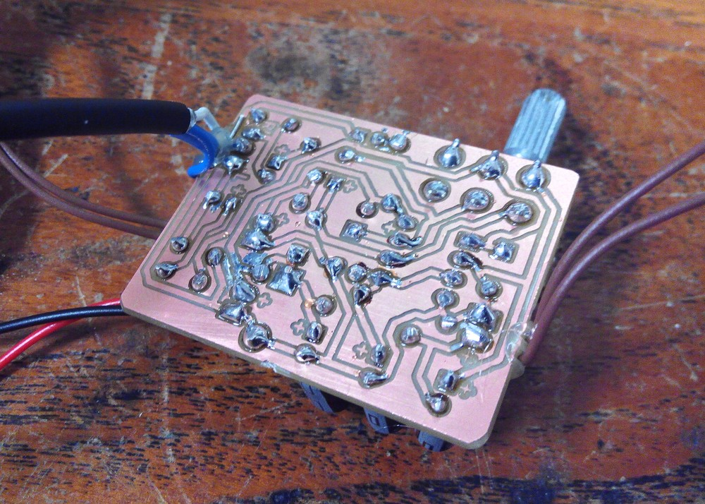

# Stereo microphone amplifier

Stereo microphone amplifier circuit with gain control.  

The circuit has been tested with the POM-5238P-R microphone capsules:  
<http://www.puiaudio.com/product-detail.aspx?categoryId=4&partnumber=POM-5238P-R>  

CNC manufacture files (gerbers, FlatCAM project & gcodes) are available in the [Gerber](Gerber) folder.  

Pictures  
--
  
  
  
  
  
  
  
  
  

Acknowledgments  
--
This circuit is a derivation from the following -very useful- Texas Instruments guide:  
[Single-Supply, Electret Microphone Preamplifier Reference Design](http://www.ti.com/tool/TIPD181) by John Caldwell  
Gain control is achieved by replacing R2 (75k) with a 100k dual potentiometer.  

Author & license  
--
Author: Carlos Garcia Saura (<http://www.carlosgs.es>)  
License: CC-BY-SA (<http://creativecommons.org/licenses/by-sa/4.0/>)  

