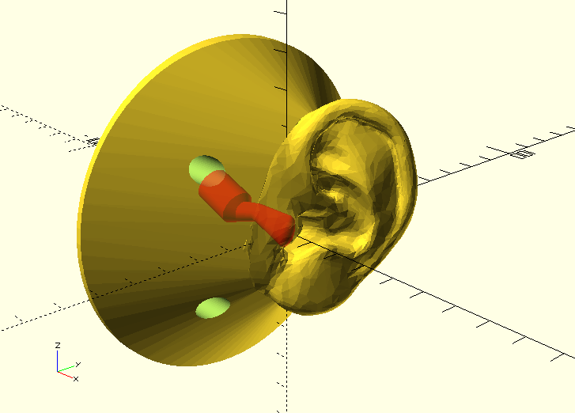
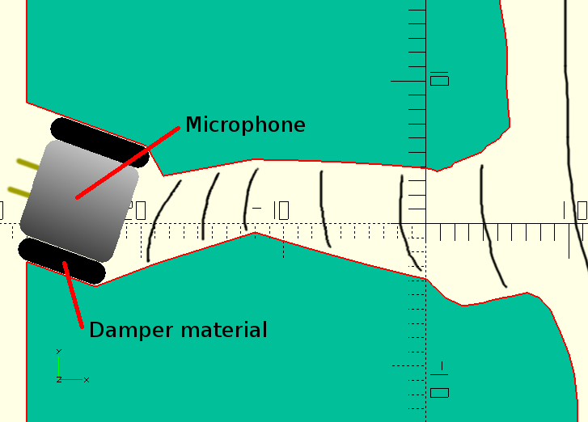

# OpenBinaural
Low-cost 3D-printable binaural microphone.  

[**Click here for the assembly instructions**](Electronics/ASSEMBLY.md)  

  

3D-printable ears  
--
The [left](binaural_mic_left.stl) and [right](binaural_mic_right.stl) ears, and the [potentiometer knob](potentiometer_knob.stl) can be 3D-printed in PLA or ABS. Flexible materials may create more realistic effects!  
The support for the ears can be laser-cut out of 3mm plywood ([DXF file](wood_support.dxf)) or 3D printed ([STL file](wood_support_assembled.stl)).  

  

Electronics  
--
The KiCad sources for the electronics can be found in the [Electronics](Electronics) folder.  
Here are the [schematic](Electronics/stereo_mic_amplifier.pdf) and [layout](Electronics/pictures/stereo_mic_amplifier_layout.png).  
The Gerber files, B/W layout in PDF, and CNC gcode files can be found [here](Electronics/Gerber).  

  

Detailed ear canal
--
  
  

Acknowledgments  
--
The awesome ear model was designed by Jonathan March:  
<http://www.thingiverse.com/thing:499001>, <http://professorgreenscreen.com/>  
For this project, the STL was modified with [FreeCAD](http://freecadweb.org/) and [Blender](http://www.blender.org/)  

Great inspiration was taken from [3Dio](http://3diosound.com/).
If you need professional quality & high-performance, check out their Free Space microphones!  

The potentiometer knob model is derived from John Ridley's: <https://www.youmagine.com/designs/knob-for-potentiometer-parametric>

I want to thank [Imperial College Advanced Hackspace](http://icah.org.uk/) and [Imperial College Robotics Society](http://icrobotics.co.uk/) for providing the infrastructure (tools, 3D printers, laser cutters & material resources) that made this project possible. The community that has grown upon them is just amazing.  

Author & license  
--
Author: Carlos Garcia Saura (<http://www.carlosgs.es>)  
License: CC-BY-SA (<http://creativecommons.org/licenses/by-sa/4.0/>)  

