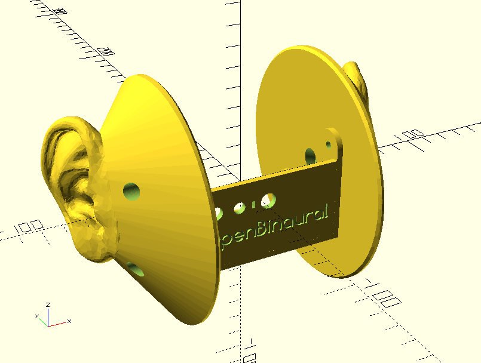

# OpenBinaural
Low-cost 3D-printable binaural microphone  

**Work in progress**  

  
  
  

Acknowledgments  
--
The awesome ear model was designed by Jonathan March:  
<http://www.thingiverse.com/thing:499001>  
<http://professorgreenscreen.com/>  

Author & license  
--
Author: Carlos Garcia Saura (<http://www.carlosgs.es>)  
License: CC-BY-SA (<http://creativecommons.org/licenses/by-sa/4.0/>)  

