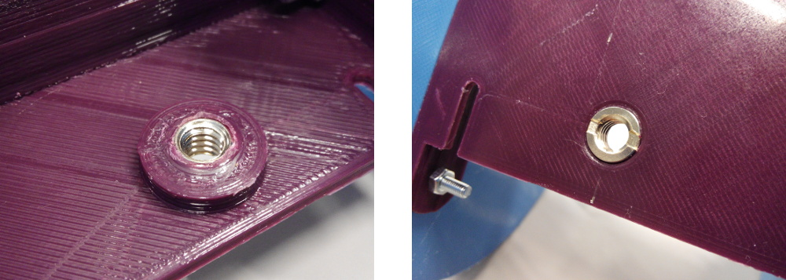
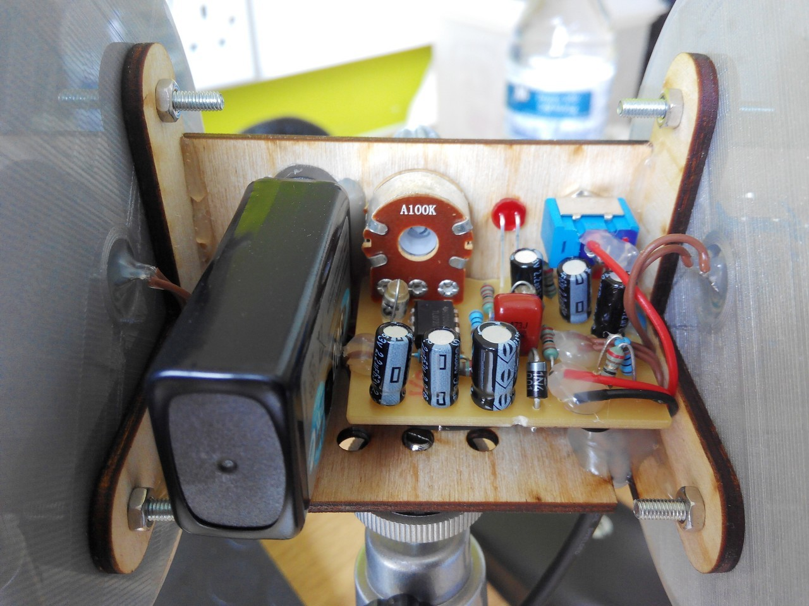

[](https://doi.org/10.5281/zenodo.10446511)
# OpenBinaural 3D microphone design
Low-cost 3D-printable binaural microphone.  

Project presented at [**OSHWDem 2015**](http://oshwdem.org/) (Open Source Hardware Demonstration in A Coruña, Spain) and [**Maker Faire Bilbao 2015**](http://bilbaomakerfaire.com/meet-the-makers-2015/). First featured in [**Hackaday**](http://hackaday.com/2015/06/28/3d-printing-binaural-microphones/).

Assembly instructions
--
[**Click here for the full assembly instructions**](https://github.com/carlosgs/OpenBinaural/wiki)  

Demo recordings
--
* By [Philippe Benaim](https://www.youtube.com/channel/UCL3Ne8XJYRqAHHRvmHdczcw):
 * Un tour Montgolfière [(link)](https://www.youtube.com/watch?v=H2nlUVNs7Po)
 * Château de Chenonceau Outside [(link)](https://www.youtube.com/watch?v=rT2So4uhhjw)
 * Vacances Aout 2015 [(link)](https://www.youtube.com/watch?v=p6LAYfAAe6M)
* By Carlosgs:
 * Sea shore in A Coruña, Spain [(link)](https://www.youtube.com/watch?v=49GC-DsRlKY)
* If you use the mic, please let me know, I'd love to *hear* about it! :-)


Assembled OpenBinaural microphone:  

  


3D-printable ears  
--
The [left](binaural_mic_left.stl) and [right](binaural_mic_right.stl) ears, and the [potentiometer knob](potentiometer_knob.stl) can be 3D-printed in PLA or ABS. Flexible materials may create more realistic effects!  
The support for the ears can be laser-cut out of 3mm plywood ([DXF file](wood_support.dxf)) or 3D printed ([STL file](wood_support_assembled_simplified.stl)).


  

Tripod mount detail:  
  
The metal insert can be found in eBay as *1/4" to 3/8" convert screw*  

Electronics  
--

**Note: The amplifier circuit is very outdated and noisy! Instead I recommend connecting the microphone capsules directly to the recorder. See [here](https://github.com/carlosgs/OpenBinaural/wiki#if-you-have-a-gopro-you-dont-need-the-amplifier-circuit) for an example.**

The KiCad sources for the electronics can be found in the [Electronics](Electronics) folder.  
Here are the [schematic](Electronics/stereo_mic_amplifier.pdf) and [layout](Electronics/pictures/stereo_mic_amplifier_layout.png).  
The Gerber files, B/W layout in PDF, and CNC gcode files can be found [here](Electronics/Gerber).  

  

Detailed ear canal
--
  
  

Where to buy
--
I currently have no plans to sell this microphone, it has an open license so **anyone can build it or sell it** (as long as they provide attribution and publish their modifications as open too).  
Please refer to the following links if you just need a binaural microphone that works out of the box:  

- [**3Dio**](https://3diosound.com/)
- [**SR3D**](https://www.sr3d.co.uk/), [**Ebay**](https://www.ebay.co.uk/str/sr3dbinauralmicrophones)

Acknowledgments  
--
* The awesome ear model was designed by **Jonathan March**:  
<http://www.thingiverse.com/thing:499001>  
For this project, the STL was modified with [FreeCAD](http://freecadweb.org/) and [Blender](http://www.blender.org/)  

* Great inspiration was taken from [**3Dio**](http://3diosound.com/).
If you need professional quality & high-performance, check out their Free Space microphones!  

* The potentiometer knob model is derived from **John Ridley's**: <https://www.youmagine.com/designs/knob-for-potentiometer-parametric>

* I want to thank [**Imperial College Advanced Hackspace**](http://icah.org.uk/) and [**Imperial College Robotics Society**](http://icrobotics.co.uk/) for providing the infrastructure (tools, 3D printers, laser cutters & material resources) that made this project possible. The community that has grown upon them is just amazing.  

* Also thanks to Mr Rodrigo García Saura for sourcing the 1/4" to 3/8" convert screw for the tripod mount  

Author & license  
--
Author: Carlos Garcia Saura (<https://github.com/CarlosGS/>)  
License: CC-BY-SA (<http://creativecommons.org/licenses/by-sa/4.0/>)  


Please cite as:
--

Latex / Bibtex citation:

```bibtex
@misc{garciasaura2015binaural,
  author = {Garcia-Saura, Carlos},
  title = {Open Binaural 3D microphone design},
  publisher = {GitHub},
  year = {2015},
  doi = {10.5281/ZENODO.10446511},
  url = {https://doi.org/10.5281/ZENODO.10446511}
}
```

APA style citation:

- García-Saura, C. (2015). Open Binaural 3D microphone design. GitHub. https://doi.org/10.5281/ZENODO.10446511

Also check out my previous work _"3D Video with Binaural Audio"_:

- García-Saura, C. (2011). Vídeo en 3D con Sonido Binaural. Congreso del XXIV Certamen Jóvenes Investigadores INJUVE, CEULAJ Málaga. INJUVE. https://doi.org/10.5281/ZENODO.10445722
