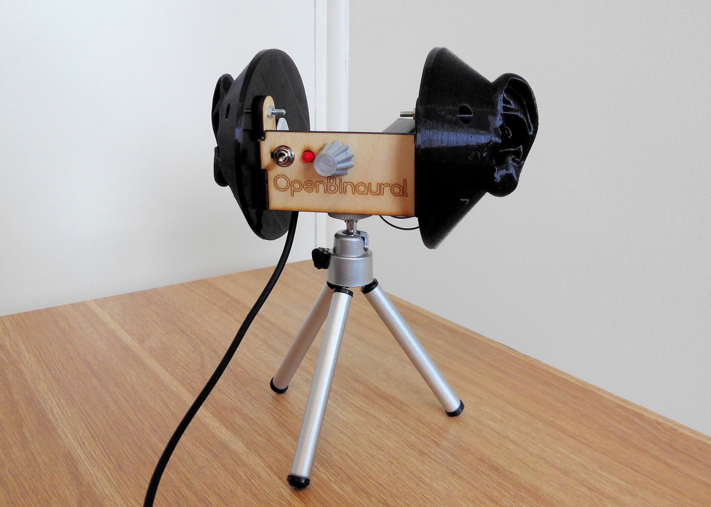

# OpenBinaural
Low-cost 3D-printable binaural microphone  

**Work in progress**  

First 3D audio quality test: <https://www.youtube.com/watch?v=Pvyww-hgYPw>  
Second test (with noise issue fixed): <https://www.youtube.com/watch?v=Wdz7qdhmqv8>  

  

Detailed ear canal
--
  
  

Acknowledgments  
--
The awesome ear model was designed by Jonathan March:  
<http://www.thingiverse.com/thing:499001>  
<http://professorgreenscreen.com/>  
For this project, the STL had to be fixed with [FreeCAD](http://freecadweb.org/) and [Blender](http://www.blender.org/)  

Great inspiration was taken from [3Dio](http://3diosound.com/).
If you need professional quality & high-performance, check out their Free Space microphones!  

The potentiometer knob model is derived from John Ridley's: <https://www.youmagine.com/designs/knob-for-potentiometer-parametric>

Author & license  
--
Author: Carlos Garcia Saura (<http://www.carlosgs.es>)  
License: CC-BY-SA (<http://creativecommons.org/licenses/by-sa/4.0/>)  

